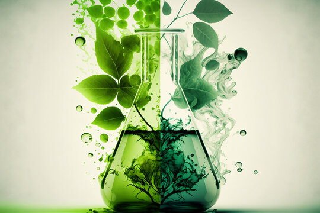
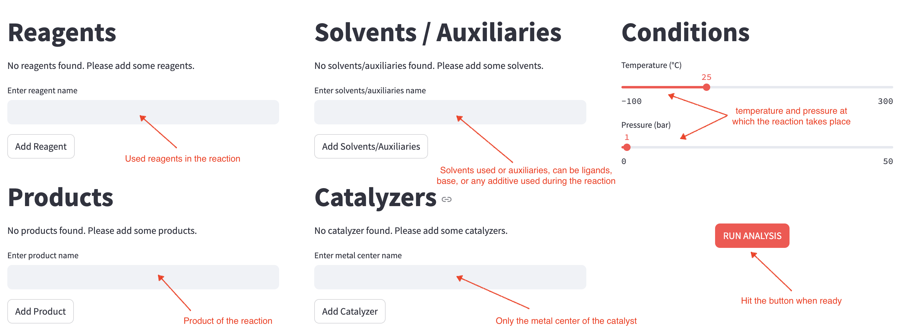

<p align="center">
  
</p>

<p align="center">
  
</p>

<h1 align="center">
🌱 Green Chemistry 🌱
</h1>

<h2>
<strong>Using programming to reduce the Environmental and Human impact of Chemical Reactions, inspired by the 12 principles of Green Chemistry</strong>
</h2>

<br>

 
## 🧑‍🔬 Team
 
- Clara Veron
- Inès Hamouni 
- Thomas Cohen 
- Edward Von Doderer

## 📖 Contents

- [Introduction](#-introduction)
- [Features](#-features)
- [Usage](#-usage)
- [Installation](#-Setup)
- [Development installation](#-development-installation)
- [License](#-license)

## 🖊️ Introduction

🌱 The Green Chemistry project is based on chemical reaction sustainaility. Concerning the growing environmental challenges and climate change, scientists need to understand how their work impact the environment and minimize it. This tool is aimed at raising awareness and supporting decision-making by evaluating the environmental and human impact of a given reaction. 

🧪 The project features an interactive Streamlit interface where users can input solvents, reactants, metal catalyst, products and reaction conditions (temperature and pressure). The interface output is then a summary of the reaction's environmental footprint.  

Green Chemistry is designed to evaluate all types of chemical reactions, however, the focus is put on coupling reactions, as they are among the most widely used transformations in chemistry.   
This project is inspired by the 12 principles of Green Chemistry ♻️. 

## 🌱 Features

This package allows users to: 

- Evaluates atom economy of their reaction 
- Estimate energy consumption based on temperature and pressure conditions
- Asses the toxicity of the metal catalyst used
- Identify GHS hazard pictograms for each compound involved
- Predict yield of the reaction


## 🔥 Usage

Launch the Streamlit interface to evaluates the environmental impact of your chemical reaction: 
```
streamlit run script_interface.py
```
Once the interface is running: solvents/auxiliaries, reagents, products, and catalysts can be added and the reaction conditions can be set (temperature and pressure).   
Make sure to click the "Add" button after each input, then hit "Run Analysis".

<p align="center">
  
</p>

In just one click, you will get a complete analysis: 
⚠️ Hazard pictograms, 🧪 Atom economy, 🌡️ Reaction condition efficiency and a yield prediction.

When you're done, return to the terminal and press ```Ctrl+C``` to close the interface.


## 👩‍💻 Installation

To run the project locally, make sure you are properly setup using the following steps (commands): 

First, clone the Green-chemistry repository on your computer, which allows you to downloads the project files from Github to your computer 
```
git clone https://github.com/InesHamouni/Green-chemistry.git
```
Then, access the project directory.
```
cd Green-chemistry
```
Create a new environment from the repository's env.yml file.
```
conda env create -f env.yml
```
Activate this enviroment.
```
conda activate green_env
```

Once the environment is activate go to the correct folder and launch the Streamlit interface. 

```
(green_env) cd src/green_chemistry
(green_env) streamlit run script_interface.py
```

At this point, everything is setup on your computer and the Streamlit interface is accessible via your browser. 
Enjoy exploring the interface !!

To stop the Streamlit interface, just return to your terminal and press ```Ctrl+C```.


## 🛠️ Development installation

Initialize Git (only for the first time). 

Note: You should have create an empty repository on `https://github.com:ineshamouni/Green-chemistry`.

```
git init
git add * 
git add .*
git commit -m "Initial commit" 
git branch -M main
git remote add origin git@github.com:ineshamouni/Green-chemistry.git 
git push -u origin main
```

Then add and commit changes as usual. 

To install the package, run

```
(green_env) $ pip install -e ".[test,doc]"
```

### Run tests and coverage

```
(green_env) tox
```


## 📖 Licence

This project is under the MIT licence.
The MIT License is a permissive open-source license that allows free use, modification, and distribution of the software. To have an overview of it, please refer to the LICENSE file included in the repository.

